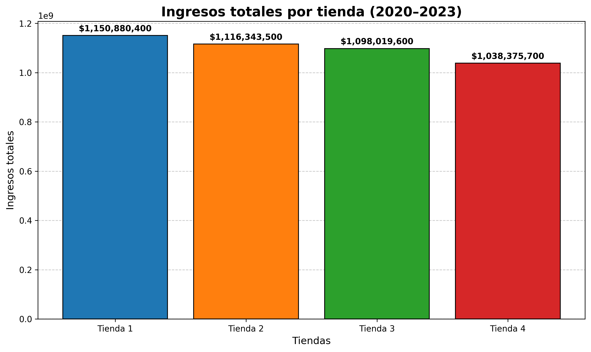
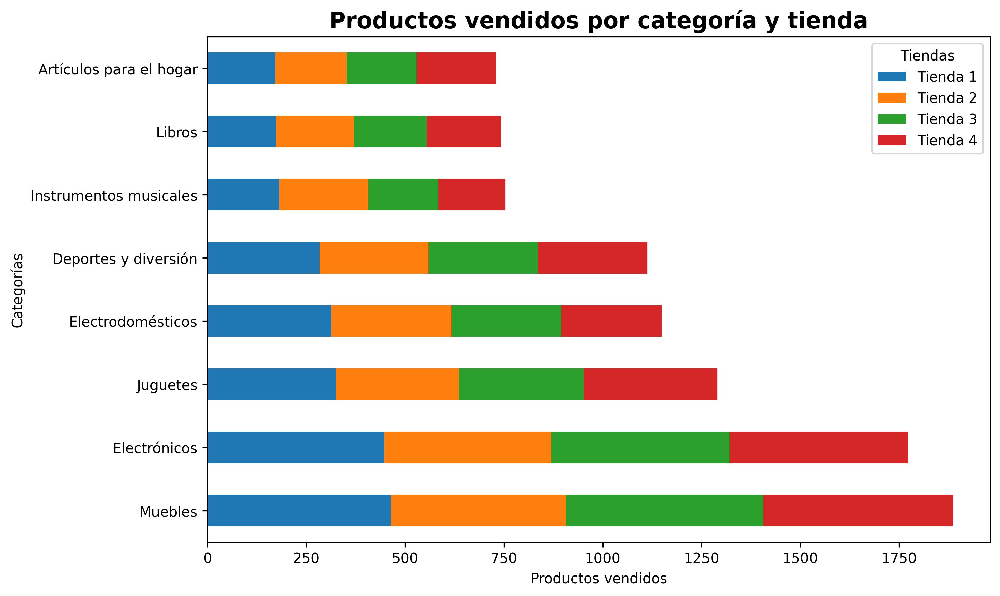
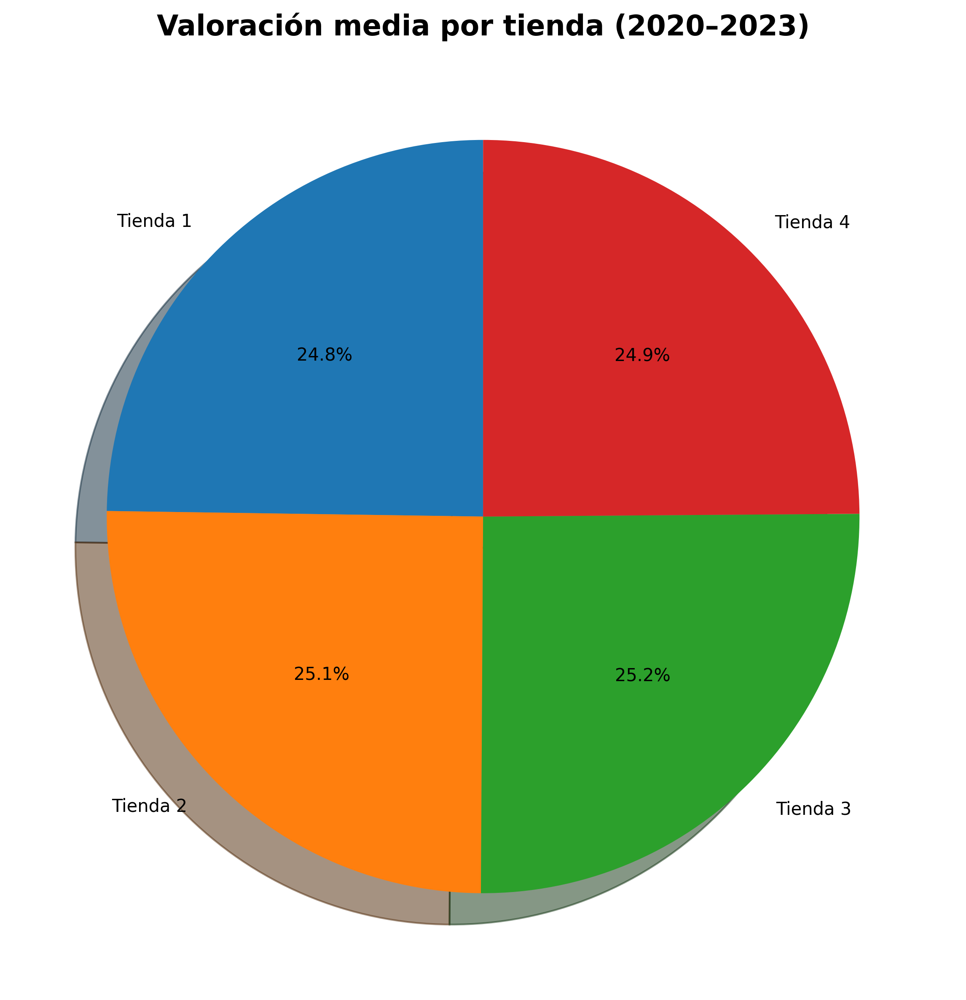

# 📊 Análisis Detallado de Resultados

**Importante:** Los datos proporcionados por el Sr. Juan son íntegros y cumplen con las condiciones mínimas para su procesamiento.

---

## 🗂️ Estructura de los datos proporcionados

- **Producto**  
- **Categoría del Producto**  
- **Precio**  
- **Costo de envío**  
- **Fecha de Compra**  
- **Vendedor**  
- **Lugar de Compra**  
- **Calificación**  
- **Método de pago**  
- **Cantidad de cuotas**  
- **Latitud (`lat`)**  
- **Longitud (`lon`)**

> 💻 Esta es la estructura con la que se pudo trabajar para obtener este análisis.

---

## 💰 Ingresos totales de las tiendas

- **Tienda 1**: `$1,150,880,400.00`  
- **Tienda 2**: `$1,116,343,500.00`  
- **Tienda 3**: `$1,098,019,600.00`  
- **Tienda 4**: `$1,038,375,700.00`  

---

### 📈 Gráfico de los ingresos totales por tienda

Como podemos observar, los numeros hablan por si solos, la tienda con mas ventas fue la **Tienda #1** frente a la que menos vendio la cual es la **Tienda #4**, esto no nos dice de manera exacta que es la Tienda que se deberia de vender para la inversion de Sr. Juan, ya que hay mas factores que pueden indicar cual es la mejor opción, pero gracias a esto ya tenemos un camino el cual podemos seguir.

## **Categorías mas vendidas**:

   - **Tienda 1:**
      - **Muebles**, con un total de 465 de productos vendidos e ingresos de $187,633,700.
      - **Electrónicos**, con un total de 448 productos vendidos e ingresos de $429,493,500.
      - **Jueguetes**, con un total de 324 productos vendidos e ingresos de $17,995,700.

   - **Tienda 2:**  
      - **Muebles**, con un total de 442 de productos vendidos e ingresos de $176,426,300.
      - **Electrónicos**, con un total de 422 productos vendidos e ingresos de $410,831,100.
      - **Jueguetes**, con un total de 313 productos vendidos e ingresos de $15,945,400.

   - **Tienda 3:**  
      - **Muebles**, con un total de 499 de productos vendidos e ingresos de $201,072,100.
      - **Electrónicos**, con un total de 451 productos vendidos e ingresos de $410,775,800.
      - **Jueguetes**, con un total de 315 productos vendidos e ingresos de $19,401,100.

   - **Tienda 4:**  
      - **Muebles**, con un total de 480 de productos vendidos e ingresos de $192,528,900.
      - **Electrónicos**, con un total de 451 productos vendidos e ingresos de $409,476,100.
      - **Jueguetes**, con un total de 338 productos vendidos e ingresos de $20,262,200.

Con este analisis podemos observar que lo mas vendido en su respectiva categia fueron los Muebles y Electrónicos, seguidos de los Juguetes y Electrodomesticos

En los resultados se destaca que apaesar de ser a Tienda 1 es la que más ingresos ha tenido en el perido de tres años, la Tienda 4 es quién más ingresos tiene en cada una de las categorías más vendidas. También se destaca por tener un buen balance de ingresos a lo largo de las categorías, siendo consistente en la venta de Electrónica y Muebles. A pesar de tener menores ingresos totales, es una tienda eficiente en términos de ventas por categoría

## **🤵Valoración de los clientes**:

Con este podemos ver la satisfacción de los clientes.

 Valoración media de la Tienda 1: 3.98

 Valoración media de la Tienda 2: 4.04

 Valoración media de la Tienda 3: 4.05

 Valoración media de la Tienda 4: 4.0

 Las tiendas con las mejores calificaciónes son las Tiendas 2 y Tienda 3, llevando su puntación a mas del 4.03

 

 ## **Productos mas y menos vendidos**

 - En la Tienda #1 tenemos:
    Microondas                     60
    TV LED UHD 4K                  60
    Armario                        60
    Secadora de ropa               58
    Mesa de noche                  56
    Bloques de construcción        56
    Balón de baloncesto            55
    Bicicleta                      54
    Vaso térmico                   54
    Refrigerador                   54

 - En la Tienda #2 tenemos:
    Microondas                     62
    Batería                        61
    Guitarra acústica              58
    Pandereta                      58
    Secadora de ropa               57
    Iphone 15                      55
    Bloques de construcción        54
    Armario                        54
    Set de ollas                   52
    Cuerda para saltar             50
    Lavadora de ropa               49
    Silla de oficina               49
    Refrigerador                   49